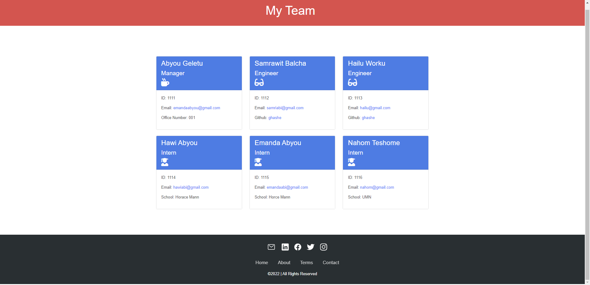

# Team Profile Generator

## Description

    This Team Profile Generator is a Node.js application that asks the user for information about the team members and creates a dynamic HTML file out of that information. Users must first perform an npm install to install all required dependencies before running this application.

    The user is prompted to describe the manager of the team as soon as the app is launched. Then the user is prompted to describe each member of the team. After entering the team member's name and selecting his/her role from the list (options include "Engineer" and "Intern"), the user enters the member's ID, email address and then enters another piece of data that will differ depending on the team member's role.

    In the case of Engineer, the app asks the user for the team member's GitHub username; in the case of Intern, it asks for the member's school; and in the case of Manager, it asks for the manager's office number.

## Table of Content

- [Installation](#installation)
- [Usage](#usage)
- [License](#license)
- [Visual](#visual)
- [Contributing](#contributing)
- [Test](#test)
- [Questions](#questions)

## Installation

    In order to use this application, simply git clone the repository to your local so that you have the Node project there on your local machine. Use *npm install* to install the npm package dependencies listed in your package.json. The inquiry package  (https://www.npmjs.com/package/inquirer) prompts you to input your command line arguments.

    Using the command line, run node index.js to begin the application. The index.html file will be generated once you answer the prompts in your command line. When you are finished answering all the prompts, the HTML file will be created inside the dist folder of the repository with the name 'index.html'.

## Usage

    As soon as you run node index.js, the application uses the inquirer package to ask you a series of questions about the manager of the team and your team members. Your responses are then used by the application to generate the profile.

    Finaly, the application's writeToFile function will create the profile of your team based on the answers you provided in the Inquirer.

## License

    MIT license has been applied to this project

## Visual

View walk through video here - [Screencastify](https://drive.google.com/file/d/15MWsLb3hn8ZhXSl6RV_6Cd6UZbjsgPTZ/view) 

## Contributing

    It would be great if you could contribute in any way

## Test

    Simple answer questions

## Questions

    I am available at the following email address if you have any questions: emandaabyou@gmail.com

    Here is my GitHub account:  [ghashe](https://github.com/ghashe)

---

_This README has been generated by ❤ [Professional-README-generator](https://github.com/ghashe/professional-README-generator) © 2022_

---
